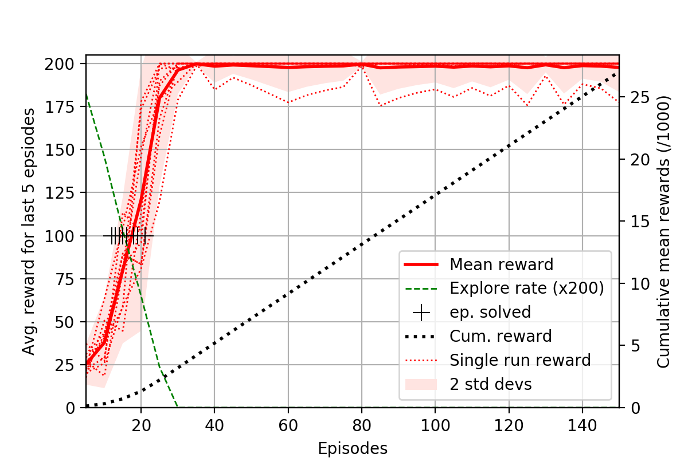
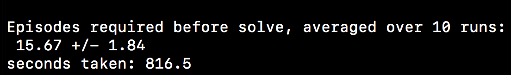

# RL_Cart_Pole_Speed_Run

Solving Cart Pole (Reinforcement Learning challenge) as fast as possible - using Q-learning with ensembles of single layer NNs.

[Cart Pole - OpenAI](https://gym.openai.com/envs/CartPole-v0/) // [Cart Pole Leaderboard](https://github.com/openai/gym/wiki/Leaderboard)

[YouTube demo](https://youtu.be/3yRsn5M5Q28)

Inspired by original work from [this arxiv paper](https://arxiv.org/abs/1805.11324)
